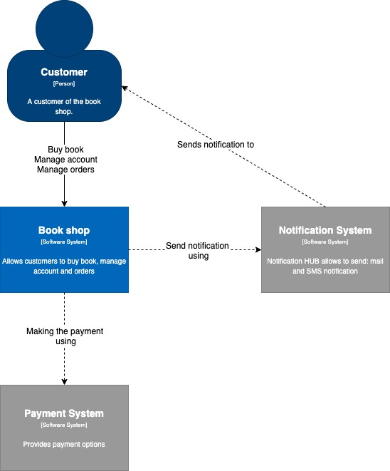
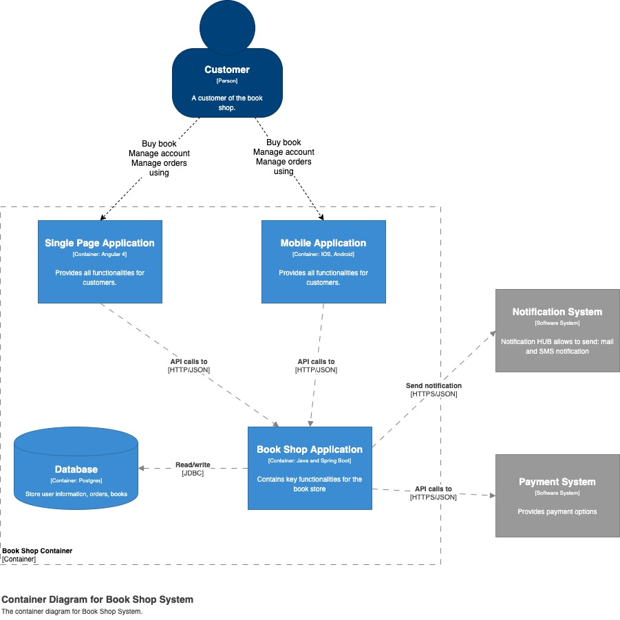
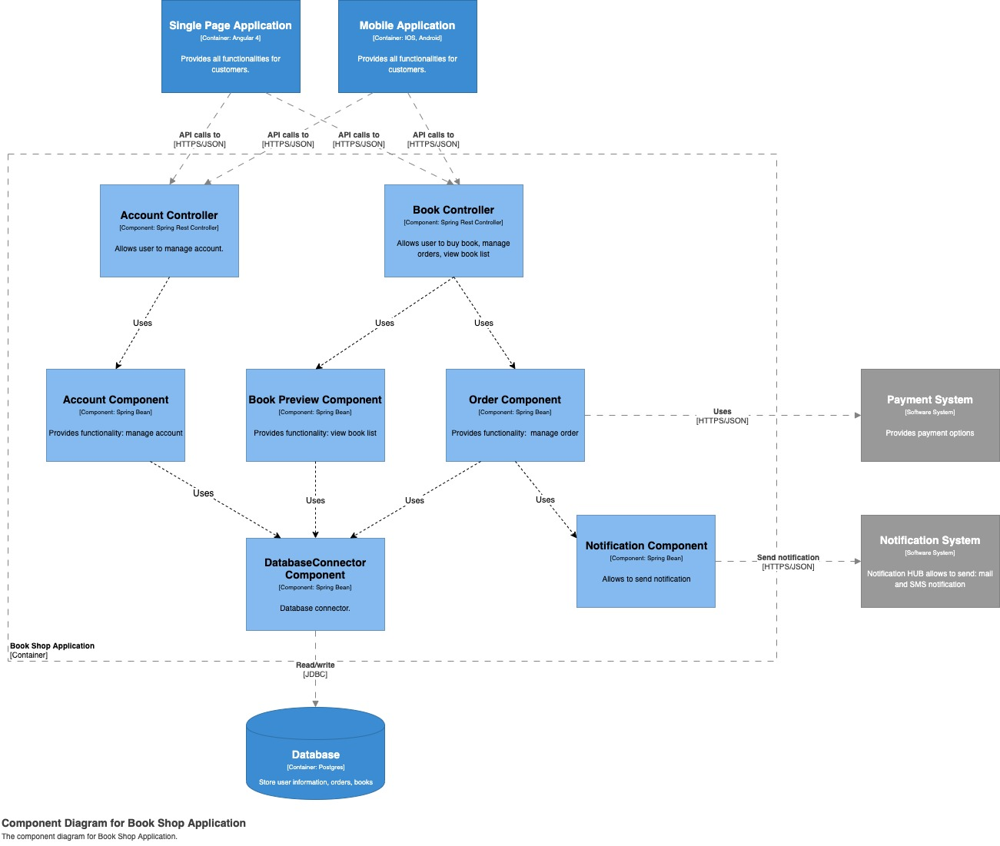

Ten wpis będzie dotyczył modelowania architektury przy użyciu C4, a może bardziej C3 🙂 . Metodyka pozwala na przejrzyste przedstawienie architektury naszego systemu każdemu, zaczynając od biznesu a kończąc na programistach. Zaletą podejścia C4 jest bardzo niski próg wejścia do tworzenia i czytania diagramów wykorzystujących metodykę C4.

Model C4 skład się z czterech poziomów, które przedstawiają odpowiedni poziom modelowania danego systemu. Zaczynając od najbardziej abstrakcyjnego, gdzie przedstawiamy tylko funkcjonalności biznesowe, a kończąc na poziomie bardzo szczegółowym, gdzie są przedstawione klasy naszego systemu.

Aby lepiej przedstawić sposób modelowania, wykorzystując C4 – stworzyłem diagramy, które przedstawiają architekturę sklepu z książkami. Na potrzeby tego wpisu założyłem:

* jednego użytkownika, który korzysta z systemu;
* system sklepu jest monolitem, w którym są zawarte wszystkie kluczowe funkcjonalności biznesowe;
* modelowany system korzysta z dwóch zewnętrznych systemów: Notification System(umożliwia wysłanie notyfikacji poprzez mail oraz SMS), Payment System(dostarcza nam różne metody płatności).
##Poziom 1 – Diagram kontekstu (System Context)
Jest to najwyższy poziom abstrakcji, który zawiera informacje na temat modelowanego systemu, użytkowników korzystających z systemu oraz zewnętrzne systemy. Ten poziom ma pokazać funkcjonalności biznesowe jakie spełnia modelowany system. Warto pamiętać, aby ten poziom diagramu był minimalistyczny oraz, aby opierał się głównie o funkcjonalności biznesowe i wskazanie aktorów (osób czy systemów, które będą z niego korzystały).

##Poziom 2 – Diagram kontenerów(Container)
Diagram kontenerów jest kolejnym poziomem w modelu C4. Ten poziom przedstawia aplikacje jako osobne byty, które uruchomione są osobno np. JAR, baza danych czy aplikacja frontend’owa. Często diagram ten jest nazywany diagramem wdrożeniowym. Prezentuje on jakie aplikacje powinny być zainstalowane na danym serwerze oraz w jakich technologiach zostały wykonane. Ważne, aby na tym poziomie zostały opisane w nawiasach kwadratowych protokoły komunikacyjne jakie występują pomiędzy kontenerami.

## Poziom 3 – Diagram komponentów (Components)
Przedostatnim poziomem jest diagram komponentów, który przedstawia nam wnętrze danego kontenera. Znajdziemy w nim szczegóły implementacyjne danych komponentów. Ten poziom jest idealny dla programistów czy architektów, pozwala on na zobrazowanie danej aplikacji, pokazując jej podział oraz wykorzystane technologie. Osobiście uważam, że ten poziom w modelu C4 powinien przedstawiać moduły czy package (w Java). Dzięki takiemu podejściu, osoby przeglądające dany diagram będą widziały korelacje pomiędzy kodem a diagramem.

##Poziom 4 – Diagram klas (Code)

Tak jak mogliście sami zobaczyć, sam Simon Brown odradza tworzenie ostatniego poziomu- przyczyn jest wiele, choć niektórzy uznają, że w ich przypadku taki diagram może być użyteczny. Trzeba do tego podejść indywidualnie, w zależności od potrzeby danego projektu. Osobiście odradzam również tworzenie tego poziomu, ponieważ bardzo ciężko jest utrzymać go w aktualnym stanie, a nieaktualne dane mogą wprowadzić w przyszłości duży zamęt.

Wskazówki
Jeszcze na sam koniec chciałbym wspomnieć o kliku ważnych kwestiach związanych z tworzeniem diagramów, opierając się o metodykę C4/C3, mianowicie:

* każdy diagram powinien posiadać opis, co przedstawia np. ” Component Diagram for Book Shop Application”;
* wszystkie relacje powinny zawierać: opis oraz informacje o protokole komunikacyjnym (jeżeli dany przypadek tego wymaga);
* trzeba również pamiętać, że każdy kontener czy komponent powinien posiadać opis, który jednoznacznie opisze funkcjonalności, które wykonuje.

Zachęcam również do zapoznania się z materiałami, które mogą być pomocne przy tworzeniu architektury opartej o C4:

* https://c4model.com
* https://www.youtube.com/watch?v=x2-rSnhpw0g