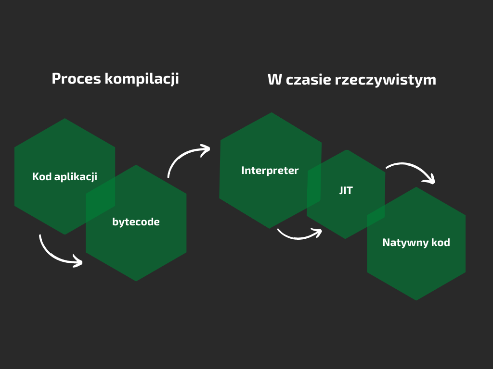

Dzisiejszy wpis chciałbym poświęcić zagadnieniu związanym z JVM, a dokładnie JIT. Każda napisana aplikacja 
na wirtualną maszynę Javy korzysta z tego dobrodziejstwa, a nie każdy wie, jak dokładnie działa i jaki może mieć
wpływ na naszą aplikację.

Java znalazła kompromis pomiędzy językami kompilowanymi, a interpretowanymi tworząc bytecode. Jest to
zbiór instrukcji do wykonania przez wirtualną maszynę Javy. Takie podejście umożliwiło uruchamianie
aplikacji na różnych platformach oraz dało duże możliwości optymalizacji, którymi zajmuje się właśnie JIT.
JIT (ang. Just-In-Time) jest sercem maszyny JVM, a jego zadaniem jest poprawienie wydajności
aplikacji w czasie jej działania. Aplikacja uruchamiana na maszynie JVM w pierwszej fazie jest interpretowana,
a nie kompilowana natychmiast do kodu natywnego. Dzieje się tak z dwóch powodów:
* (1) brak informacji, które miejsca będą najczęściej wykorzystywane (tzw. hotspoty),
* (2) brak informacji celowości wykorzystania danego kodu.

(1) kompilacja do kodu natywnego jest kosztowna i nieopłacalna dla metod rzadko wykorzystywanych,\
(2) większa liczba informacji o wykorzystaniu kodu pozwala na dobranie bardziej dopasowanych optymalizacji.

W starszych wersjach Java (przed wersją 8) to developer wskazywał jaka wersja kompilatora ma
zostać użyta. Wyróżniało się wówczas dwie wersje:
* kliencką -client (C1) wykorzystywaną przy ograniczonych zasobach i aplikacjach, gdzie kluczową kwestią
jest czas uruchomienia,
* serwerową -server (C2), która umożliwiała stosowanie bardziej zaawansowanych technik optymalizacji.
Wymagała jednak większych zasobów oraz dłuższego działania aplikacji.

W wersji 8 powyższe flagi nie mają już żadnego znaczenia i są ignorowane, a od wersji 11 nie są rozpoznawalne, a wykorzystanie ich wywoła błąd. Obecnie wszystkie maszyny wykorzystują kompilacje etapową (ang. Tiered Compilation),
która łączy zalety wersji klienckiej i serwerowej. Składa się ona z etapów: 
* Interpretacja kodu
* Kompilacja C1 (protsta)
* Ograniczona kompilacja C1
* Pełna kompilacja C1
* Kompilacja C2

JIT w celu optymalizacji kodu stosuje wiele zaawansowanych technik, które umożliwiają przyspieszenie
działania aplikacji. 
### Przykładowe metody optymalizacji
* **Zagnieżdżanie metod (Method inlining)** - optymalizacja polega na zastąpieniu wywołania funkcji ciałem wywoływanej
metody
* **Kompilacja do kodu natywnego (Native code)** jest to jedna z najbardziej efektywnych metod optymalizacji,
która pozwala uzyskać nawet 20-krotne przyspieszenie. Optymalizacja polega na zastąpieniu interpretora kodu bajtowego na kod natywny w trakcie pracy aplikacji. 
* **Usuwanie martwego kodu (Dead code elimination)** - usuwa nieużywany kod zachowując funkcjonalność 
przykładem może być usunięcie kodu po wykonaniu optymalizacji zagnieżdżania metod.
### Przydatne flagi
* -XX:ReservedCodeCacheSize - maksymalna wielkość pamięci podręcznej. Pamięć ta jest wykorzystywana przez JIT.
* -XX:+PrintCompilation (domyślna wartość false) - umożliwia wyświetlanie informacji o każdej kompilacji,
która jest wykonywana w naszej aplikacji. 
* XX:-TieredCompilation (domyślna wartość true) - włączenie/wyłączenie kompilacji etapowej

### Profilowanie aplikacji
Wykonując profilowanie aplikacji warto zwrócić uwagę na kilka kwestii związanych z JIT:
* sprawdzić czy pamięć podręczna jest wystarczająca dla aplikacji i czy nie dostajemy
komunikatów: "CodeCache is full",
* zweryfikować wykorzystując flagę -XX:+PrintCompilation, jakie elementy są kompilowane.

Mam nadzieję, że dzięki temu wpisowi udało mi się przybliżyć, jak działa JIT oraz jaki może mieć wpływ na twoją 
aplikację. Kolejne wpisy dotyczyć będą kompilacji etapowej oraz kolejek i wątków, które szczegółowo omówię, wraz z przykładami.
Zachęcam zatem do obserwowania bloga.
 

Jeżeli chcielibyście zasięgnąć po jeszcze więcej wiedzy dotyczącej JIT oraz samego JVM, zachęcam do przeczytania
książki Scott'a Oaks'a "Java Performance: In-Depth Advice for Tuning and Programming Java 8, 11, and Beyond,
2nd Edition" to niekwestionowana kopalnia wiedzy o JVM.