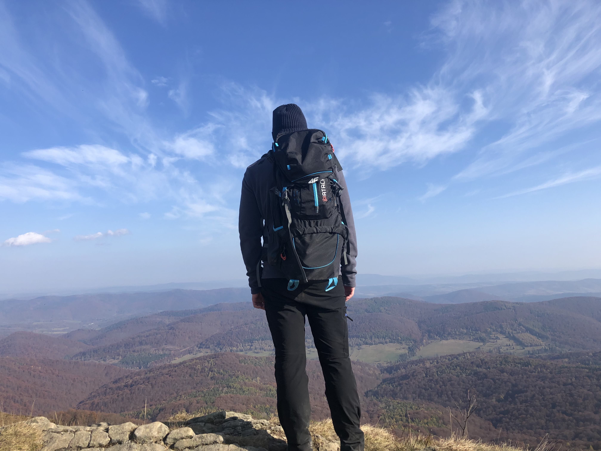

{: style="float: left"}
Jestem software engineer z ponad 6-letnim doświadczeniem.

Zawodowo interesuje się JVM, DDD oraz architekturą. Staram się myśleć nieszablonowo i patrzeć na problem z perspektywy wyzwania, łącząc zagadnienia biznesowe z technologicznymi.

Aktualnie rozwijam skrzydła w Allegro, będąc częścią zespołu DEX. Dodatkowo spełniam się naukowo, zajmując się optymalizacją kompilatorów optymalizujących, jestem również autorem kilku artykułów naukowych.

Prywatnie lubię chodzić po górach, żeglować, być blisko natury, co jest świetnym kontrastem dla wielogodzinnych posiedzeń przed ekranem komputera.
